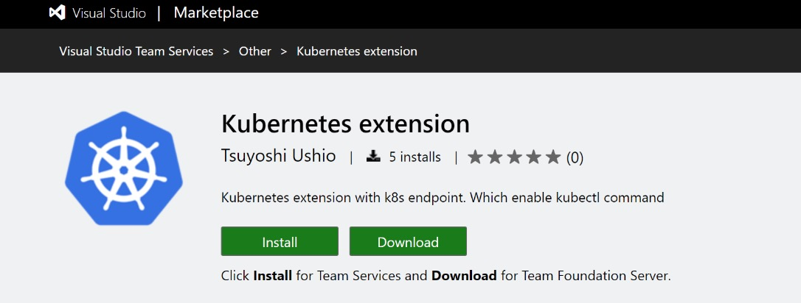
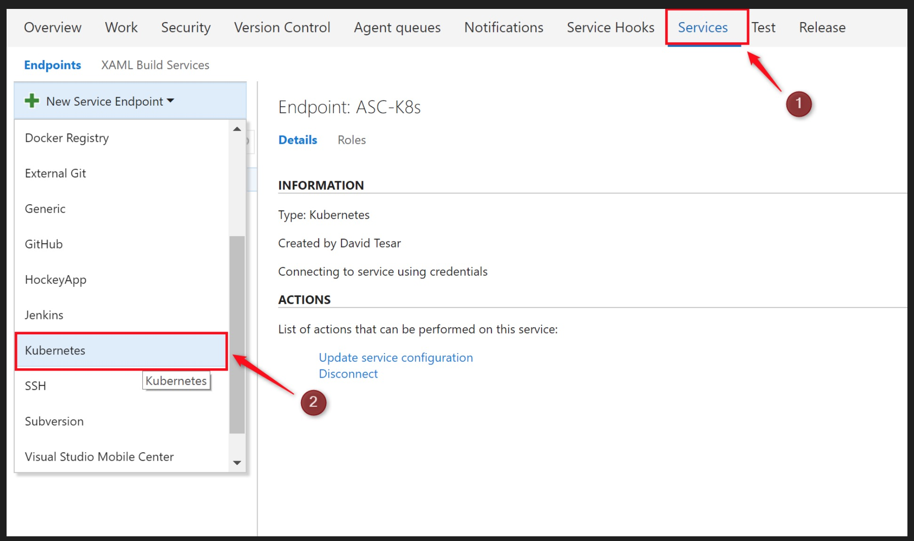

# Kubernetes extension for VSTS 


### [View all Roadmaps](https://github.com/nholuongut/all-roadmaps) &nbsp;&middot;&nbsp; [Best Practices](https://github.com/nholuongut/all-roadmaps/blob/main/public/best-practices/) &nbsp;&middot;&nbsp; [Questions](https://www.linkedin.com/in/nholuong/)
<br/>

Enable Kubernetes extension for VSTS. Kubernetes endpoint for kubectl config and kubectl apply build task.
Mainly aim for using Linux Hosted Agent(preview).



# 1. Prerequisite

You need typings / tsc / tfx commands. 

Please refer these to install.

```
npm install
npm install typings@2.1.0  --global-style
npm install typescript@2.1.5 --global-style
npm install tfx-cli@v0.3.45  --global-style
```

FYI:
[typings](https://www.npmjs.com/package/typings)
[tfx-cli](https://www.npmjs.com/package/tfx-cli)
[typescript](https://www.typescriptlang.org/docs/tutorial.html)

# 2. Build the extension

I tested via windows environment.
```
npm test               // Compile Typescript and Test these
npm run deploy         // Deploy kubectl and node_modules into task directory
npm run build          // Build *.vsix file
``` 

If you want to debug these. NOTE: I'm using GitBash for this developmnet.
You can see the debug output. 
```
 export TASK_TEST_TRACE=1
```

# 3. Upload to the market place

Go to the Market place [Market Place Manage](https://marketplace.visualstudio.com/manage)
Then upload and share with your VSTS account.
[Nho Luong Github publisher site]([https://marketplace.visualstudio.com/manage/publishers/tsuyoshiushio](https://github.com/nholuongut))

# 4. Current road map

Now I just start this project. Just initial commit. 
However, you can see the image of the endpoint and build task. 

1. Flexbile Command Excecution except for `kubectl apply` 
2. Enable to select the version of kubectl and automatically installed.

# 5 How to use this

## 5.1. Create an endopint 

### Choose Kubernetes endpoint

Choose Kubernetes endpoint.



### Set your endpoint 

Kubernetes Connection pops up. Then fill the box.


* Connection name: Endpoint name (Anything is OK)
* Server URL : K8s Cluster URL for memo (Not used for the task until now)
* kubeconfig : Copy & paste your config file 

You can get config file from your k8s master node `.kube/config`. 
See [Microsoft Azure Container Service Engine - Kubernetes Walkthrough](https://docs.microsoft.com/en-us/azure/container-service/container-service-kubernetes-walkthrough)
Then copy the file content and paste on kubeconfig column.

**NOTE**  

If you copy config file into Kubeconfig, the build log of VSTS might show you the contents.
This happens when you copy multiline. 
Kubernetes tasks support base64 encoding for Kubeconfig column. If you want to avoid this problem,
you can convert your config file into base64 string. You can find the tool for converting config file. `tools/convert.ts`

**Usage**

your config file should be `LF` not `CRLF` if you want to use on Linux hosted build.

```
tsc -p .
node tools/convert.js {filename}
```

You can find {filename}_new file which include base64 encoding string.


## 5.2. Store and link kubectl command link with VSTS private repository

Link your repo which has kubecntl command. 


Please `chmod +x kubectl` before adding kubectl to your repo.


## 5.3. Setup your kubectlapply task

Then you can use the endpoint, specify the kubectl command and YAML file 
for deployment. Internally, it calls `kubectl apply` command. 

If you want to change the YAML file dynamically, you can use [Replace tokens](https://marketplace.visualstudio.com/items?itemName=qetza.replacetokens) on the VSTS Marketplace.

NOW you can see the `downloadVersion` textbox. If you don't specify `KubectlBinary`, this task automatically download the latest
kubebinary. If you want to specify the version, fill the `downloadVersion`. 

## 5.4. Setup your kubectlgeneral task

You can use every kubectl command you want. Use kubectlgeneral task.
You can specify a lot of arguments separated with space or new line. 


# 6 Resources

[Step by Step: Node Task with Typescript API](https://github.com/nholuongut/azure-pipelines-task-lib/blob/master/node/docs/stepbystep.md)

# 🚀 I'm are always open to your feedback.  Please contact as bellow information:
### [Contact ]
* [Name: nho Luong]
* [Skype](luongutnho_skype)
* [Github](https://github.com/nholuongut/)
* [Linkedin](https://www.linkedin.com/in/nholuong/)
* [Email Address](luongutnho@hotmail.com)


[](https://ko-fi.com/nholuong)

# License
* Nho Luong (c). All Rights Reserved.🌟
